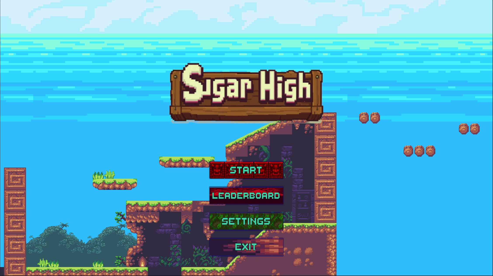
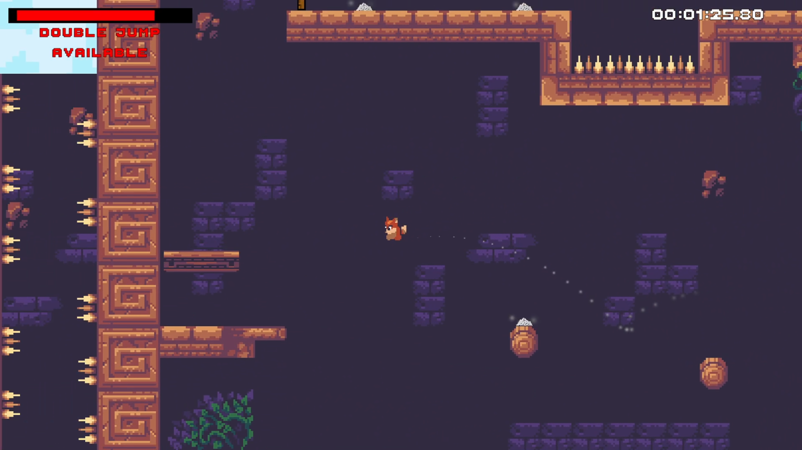
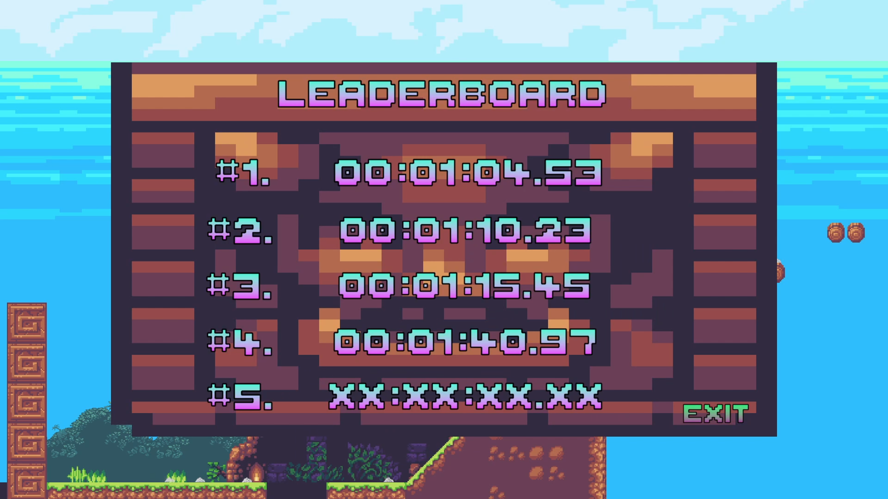
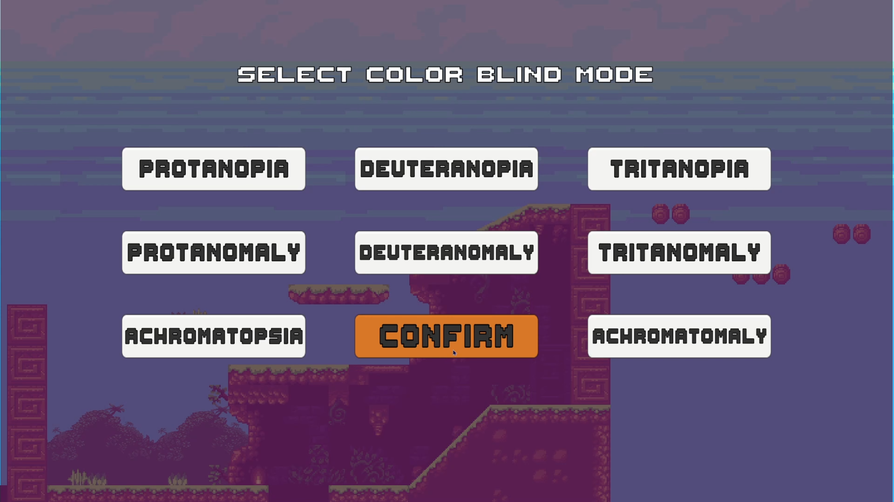
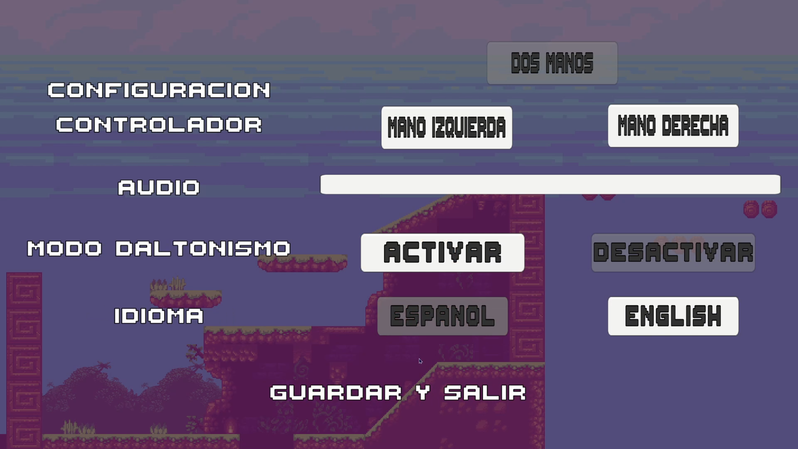

# Sugar High

**Sugar High** is a fast-paced 2D platformer developed in Unity as part of CSUMB's 438: Software Engineering.

You play as a sugar-crazed fox racing toward the candy shop — but beware: every sweet treat you collect powers you up *and* pushes you closer to a sugar crash!

## 🕹️ Gameplay Overview

- 🦊**Collect sugar** to increase your speed.
- 🍬**Avoid bad candy** that slows you down.
- ⚠**Balance the sugar high** — max it out and you'll be sent back to your last checkpoint!
- ⏱️**Race to the finish** — designed with speedrunning in mind, race against the clock to beat your previous best times.

A fun and chaotic platformer that’s all about *risk vs reward*.

## 🚀 Tech Stack

- **Engine:** Unity 2022.3.46f1
- **Design & Planning:** Figma
- **Task management:** Trello 

## 👥 Team

Built by the following team to satisfy CSUMB's CST438 Software Engineering project 02 requirements:

- Josh Dickerman  
- Nathan Trujillo  
- Sabino Galindo  
- Kobi Murakami

## 📷 Screenshots

  
  

  
  

## 📌 Project Notes

This game was developed as a collaborative 4-week long class project focused on putting the Agile process into practice.

---
